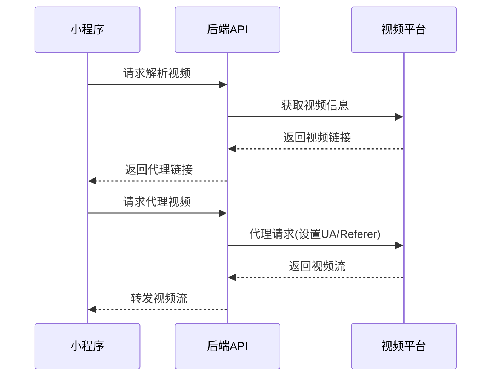

# 视频解析微信小程序

一个功能完整的视频解析微信小程序，支持多个主流视频平台的视频解析、去水印和下载功能。

## 🎬 微信小程序去水印功能

本项目专为微信小程序环境设计，提供强大的视频去水印解决方案：

### 🔥 核心优势
- **🎯 专业去水印**：智能识别并移除各大平台的水印标识
- **📱 小程序原生**：完全基于微信小程序开发，无需跳转外部应用
- **⚡ 实时处理**：云端高效处理，秒级完成去水印操作
- **🌟 高清保持**：去水印过程保持原视频画质不损失
- **🔒 隐私安全**：所有处理在云端完成，不保存用户视频内容
- **💾 一键保存**：处理完成后可直接保存到手机相册

### 📺 支持去水印的平台
- ✅ **抖音 (Douyin)**：完美去除抖音水印和用户ID
- ✅ **快手 (Kuaishou)**：智能移除快手平台标识
- ✅ **小红书 (Xiaohongshu)**：清除小红书水印和logo
- ✅ **微博视频**：去除微博相关水印信息
- ✅ **西瓜视频**：移除西瓜视频平台标识
- ✅ **更多平台**：持续更新支持更多视频平台

### 🚀 使用流程
1. **复制链接** → 从任意支持的平台复制视频分享链接
2. **粘贴解析** → 在小程序中粘贴链接，自动识别平台
3. **选择去水印** → 勾选去水印选项，开始云端处理
4. **预览下载** → 实时预览去水印效果，一键保存到相册

## 🚀 项目简介

本项目是一个完整的视频解析解决方案，包含微信小程序前端和 Spring Boot 后端。用户可以通过小程序输入视频链接，系统会自动解析视频信息并提供下载功能，支持去水印处理。

### ✨ 主要特性

- 🎯 **多平台支持**：支持抖音、快手、小红书、B站等主流视频平台
- 🚀 **去水印功能**：自动去除视频水印
- 📱 **微信小程序**：原生小程序开发，用户体验流畅
- 🔄 **实时进度**：下载进度实时显示，支持取消下载
- 📝 **解析记录**：自动保存解析历史，方便用户管理
- 🎨 **现代UI**：基于 ColorUI 的现代化界面设计
- 🔐 **用户系统**：集成微信登录，数据隔离
- 🌐 **视频代理**：解决跨域问题，提供稳定的视频访问

## 🏗️ 项目架构

```
video-parsing-wxmini/
├── HOUDUAN/                 # 后端项目 (Spring Boot)
│   ├── src/
│   │   └── main/
│   │       ├── java/
│   │       │   └── com/video/
│   │       │       ├── controller/     # 控制器层
│   │       │       ├── service/        # 业务逻辑层
│   │       │       ├── entity/         # 实体类
│   │       │       ├── repository/     # 数据访问层
│   │       │       ├── config/         # 配置类
│   │       │       ├── common/         # 通用工具
│   │       │       └── exception/      # 异常处理
│   │       └── resources/
│   │           └── application.yml     # 配置文件
│   ├── pom.xml              # Maven 依赖配置
│   └── README.md            # 后端说明文档
├── QIANDUAN/                # 前端项目 (微信小程序)
│   ├── pages/               # 页面目录
│   │   ├── index/          # 首页 - 视频解析
│   │   ├── resolution/     # 解析结果页
│   │   ├── photos/         # 解析记录页
│   │   └── help/           # 帮助页面
│   ├── utils/              # 工具类
│   │   └── request.js      # 网络请求封装
│   ├── colorui/            # UI组件库
│   ├── app.js              # 小程序入口
│   ├── app.json            # 小程序配置
│   ├── project.config.json # 项目配置
│   └── README.md           # 前端说明文档
└── README.md               # 项目总体说明
```

## 🎯 支持的视频平台

| 平台 | 支持状态 | 去水印 | 备注 |
|------|----------|--------|------|
| 抖音 (Douyin) | ✅ | ✅ | 支持短视频和长视频 |
| 快手 (Kuaishou) | ✅ | ✅ | 支持普通视频 |
| 小红书 (Xiaohongshu) | ✅ | ✅ | 支持图片和视频 |
| 哔哩哔哩 (Bilibili) | ✅ | ❌ | 支持普通视频 |
| 微博 (Weibo) | ✅ | ✅ | 支持视频内容 |
| 西瓜视频 (Xigua) | ✅ | ✅ | 支持短视频 |
| 好看视频 (Haokan) | ✅ | ✅ | 支持短视频 |
| 皮皮虾 (Pipixia) | ✅ | ✅ | 支持搞笑视频 |
| 火山小视频 (Huoshan) | ✅ | ✅ | 支持短视频 |
| 最右 (Zuiyou) | ✅ | ✅ | 支持短视频 |

## 🔧 技术栈

### 后端技术栈
- **Java 8** - 编程语言
- **Spring Boot 2.x** - 应用框架
- **Spring Data JPA** - 数据访问
- **MySQL** - 数据库
- **Caffeine** - 缓存框架
- **Apache HttpClient** - HTTP客户端
- **Jackson** - JSON处理
- **Lombok** - 代码简化

### 前端技术栈
- **微信小程序原生开发** - 开发框架
- **WXML/WXSS** - 页面结构和样式
- **JavaScript** - 业务逻辑
- **ColorUI** - UI组件库

## 🚀 快速开始

### 环境要求

#### 后端环境
- Java 8+
- Maven 3.6+
- MySQL 5.7+

#### 前端环境
- 微信开发者工具
- 微信小程序开发账号

### 安装部署

#### 1. 克隆项目
```bash
git clone https://github.com/your-username/video-parsing-wxmini.git
cd video-parsing-wxmini
```

#### 2. 后端部署

**配置数据库**
```sql
-- 创建数据库
CREATE DATABASE video_parsing CHARACTER SET utf8mb4 COLLATE utf8mb4_unicode_ci;
```

**修改配置文件**
```yaml
# HOUDUAN/src/main/resources/application.yml
spring:
  datasource:
    url: jdbc:mysql://localhost:3306/video_parsing?useUnicode=true&characterEncoding=utf8&zeroDateTimeBehavior=convertToNull&useSSL=true&serverTimezone=GMT%2B8
    username: your_username
    password: your_password

wechat:
  miniapp:
    app-id: your_wechat_appid
    app-secret: your_wechat_app_secret
```

**编译运行**
```bash
cd HOUDUAN
mvn clean package
java -jar target/video-parsing-api-1.0.0.jar
```

#### 3. 前端部署

**修改配置**
```javascript
// QIANDUAN/app.js
globalData: {
  url: "https://your-domain.com/Video/", // 修改为你的后端地址
}
```

```json
// QIANDUAN/project.config.json
{
  "appid": "your_wechat_appid", // 修改为你的小程序AppID
}
```

**导入项目**
1. 打开微信开发者工具
2. 选择「导入项目」
3. 选择 `QIANDUAN` 目录
4. 填入小程序 AppID
5. 点击「导入」

## 🌐 视频代理功能

### 代理机制说明

本项目实现了完整的视频代理功能，解决了以下问题：

1. **跨域访问**：微信小程序无法直接访问第三方视频链接
2. **防盗链限制**：部分平台有 Referer 检查机制
3. **用户代理限制**：需要特定的 User-Agent 才能访问

### 代理实现原理



### 代理接口

```http
GET /api/proxy/{platform}/{encodedUrl}
```

**参数说明：**
- `platform`: 平台标识 (douyin, kuaishou, xiaohongshu 等)
- `encodedUrl`: Base64 编码的原始视频链接

**支持的平台代理：**
- `/api/proxy/douyin/{encodedUrl}` - 抖音视频代理
- `/api/proxy/kuaishou/{encodedUrl}` - 快手视频代理
- `/api/proxy/xiaohongshu/{encodedUrl}` - 小红书视频代理
- `/api/proxy/bilibili/{encodedUrl}` - B站视频代理
- `/api/proxy/weibo/{encodedUrl}` - 微博视频代理
- `/api/proxy/general/{encodedUrl}` - 通用视频代理

### 代理配置

```yaml
# application.yml
proxy:
  domain: https://domain.com  # 代理域名
  enabled: true               # 是否启用代理
```

## 📱 功能演示

### 1. 视频解析流程
1. 用户在小程序中输入或粘贴视频链接
2. 系统自动识别平台并进行解析
3. 显示视频信息（标题、作者、封面等）
4. 提供下载按钮和去水印选项

### 2. 下载功能
- 实时显示下载进度
- 显示下载速度和剩余时间
- 支持取消下载操作
- 下载完成后自动保存到相册

### 3. 解析记录
- 自动保存每次解析的记录
- 支持查看历史解析
- 可以重新下载历史视频
- 时间格式化显示

## 🔒 安全说明

### 隐私保护
- 所有敏感配置已替换为占位符
- 不在代码中硬编码密钥信息
- 用户数据通过 OpenID 进行隔离

### 合规使用
- 请遵守各平台的使用条款
- 仅用于个人学习和研究
- 不得用于商业用途
- 尊重原创作者权益

## ⚠️ 重要声明

**本项目仅供个人学习和研究使用，严禁商业用途！**

- 🚫 **禁止商业使用**：本项目未提供商业许可证，任何商业用途均被严格禁止
- 📚 **仅限学习研究**：项目代码仅用于技术学习、研究和个人使用
- ⚖️ **法律责任**：使用者需自行承担因违规使用而产生的一切法律责任
- 🔄 **二次开发**：如需商业使用或二次开发，请联系作者获得授权
- 📋 **平台条款**：使用时请严格遵守各视频平台的服务条款和版权规定

如有商业合作需求，请通过邮件联系：2693259565@qq.com

## 🤝 贡献指南

欢迎提交 Issue 和 Pull Request！

### 开发规范
1. 遵循现有代码风格
2. 添加必要的注释
3. 提交前进行测试
4. 更新相关文档

### 提交流程
1. Fork 本项目
2. 创建特性分支 (`git checkout -b feature/AmazingFeature`)
3. 提交更改 (`git commit -m 'Add some AmazingFeature'`)
4. 推送到分支 (`git push origin feature/AmazingFeature`)
5. 创建 Pull Request

## 📄 许可证

本项目采用 MIT 许可证 - 查看 [LICENSE](LICENSE) 文件了解详情。

## 🙏 致谢

- [ColorUI](https://github.com/weilanwl/ColorUI) - 优秀的微信小程序UI组件库
- [Spring Boot](https://spring.io/projects/spring-boot) - 强大的Java应用框架
- 所有贡献者和使用者

## 📞 联系方式

如有问题或建议，欢迎通过以下方式联系：

- 提交 [Issue](https://github.com/your-username/video-parsing-wxmini/issues)
- 发送邮件至：2693259565@qq.com

---

⭐ 如果这个项目对你有帮助，请给它一个星标！